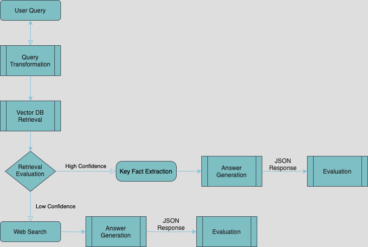

# Corrective Retrieval-Augmented Generation (CRAG) System

An implementation of Corrective RAG that enhances traditional RAG systems with:
- Retrieval quality evaluation
- Dynamic knowledge augmentation
- Key fact extraction
- Fallback to web search when needed

## Features

- **Intelligent Retrieval Evaluation**: Assesses relevance of retrieved documents
- **Contextual Query Transformation**: Rewrites queries for better retrieval
- **Key Fact Extraction**: Identifies and focuses on the most relevant information
- **Web Search Fallback**: Augments knowledge when local retrieval is insufficient
- **Structured JSON Output**: Consistent response format with citations
- **Automatic Evaluation**: Built-in LLM as a judge architecture to perform response quality assessment

## Tech Stack:

- LlamaIndex for orchestration
- DuckDuckGo for deep web search
- Qdrant for vector database
- FastEmbed for embedding

